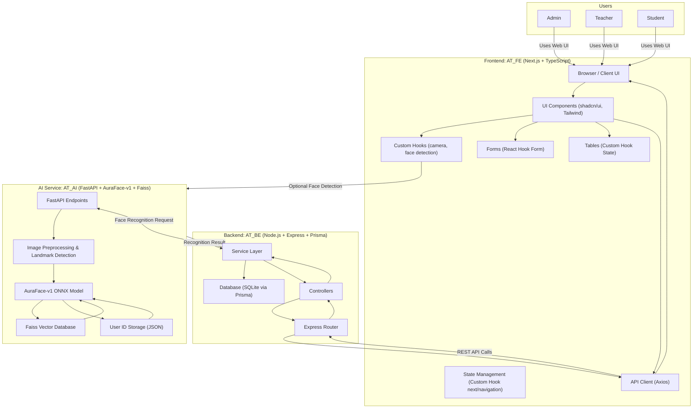
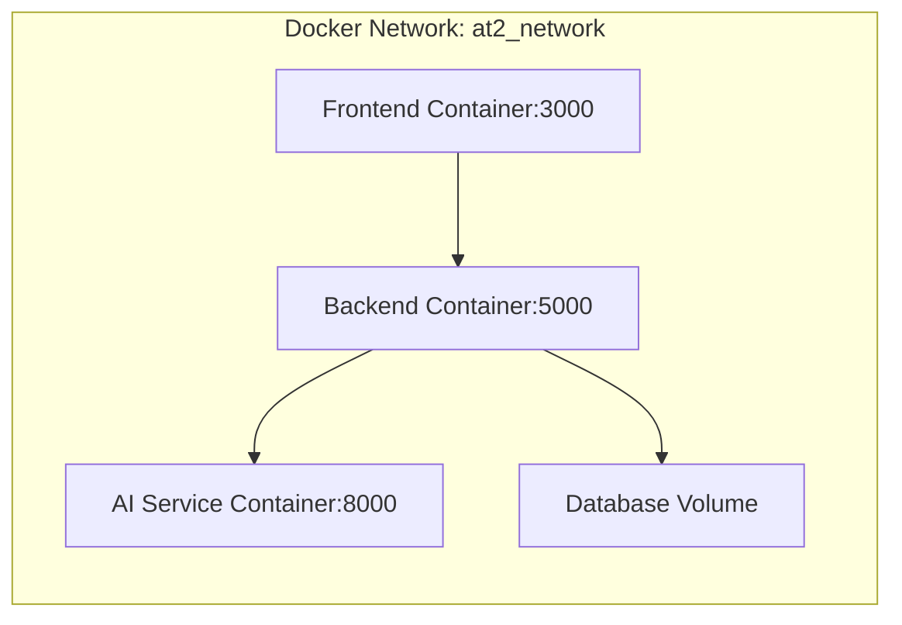
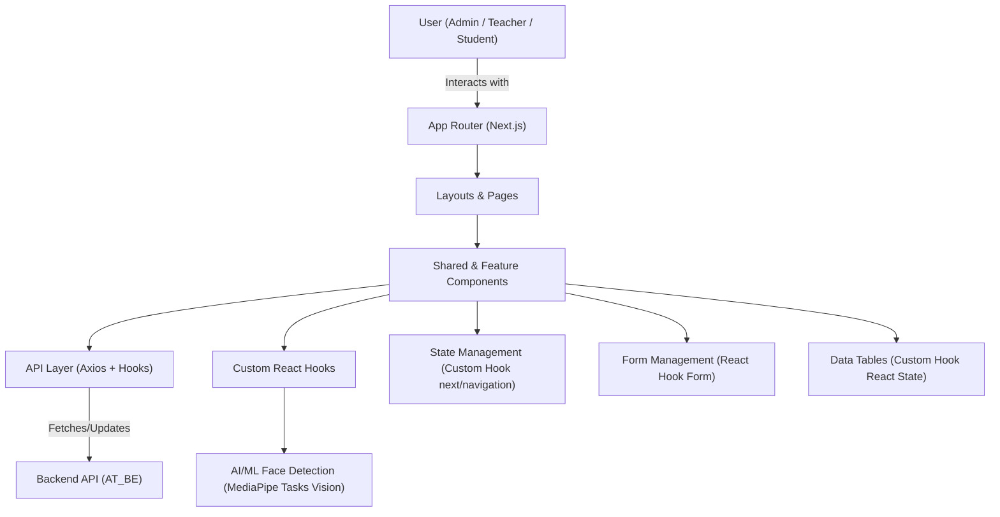
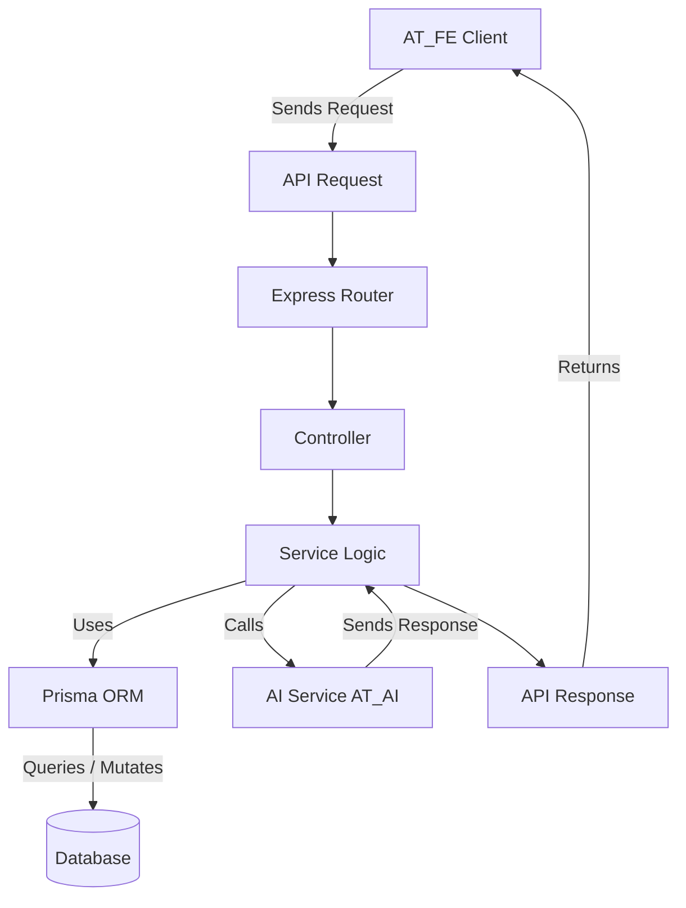
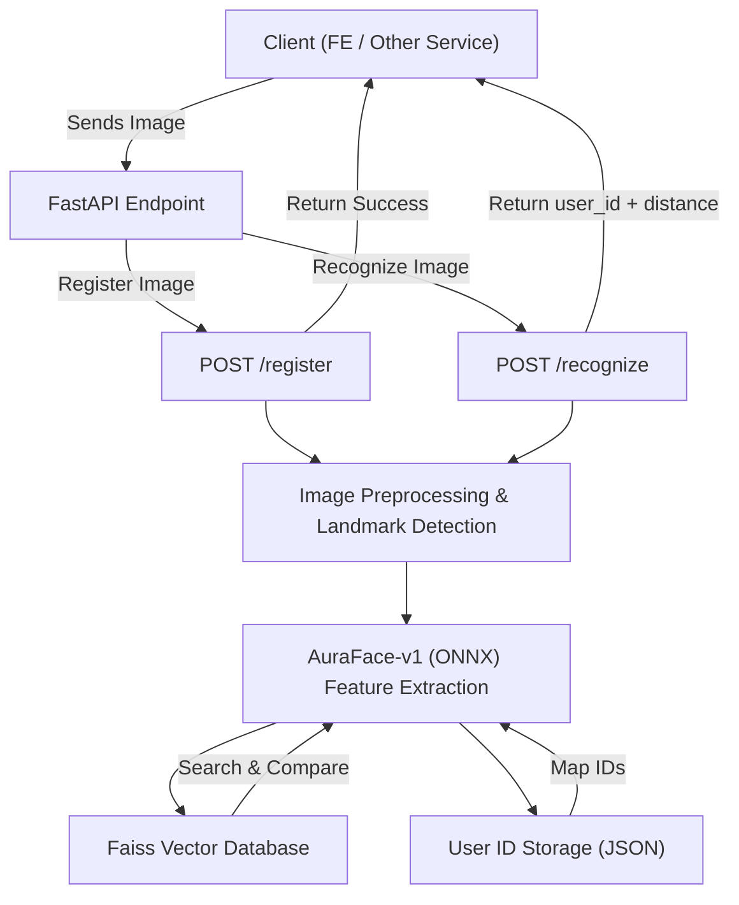
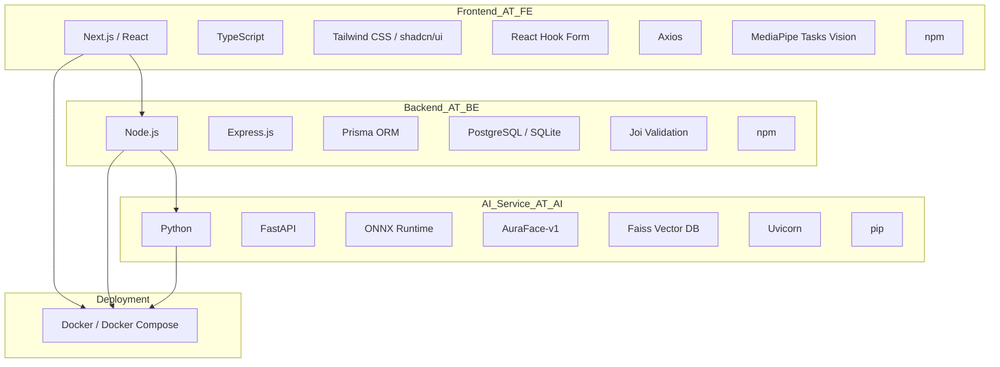

# Automated Face Recognition Attendance System

## Project Overview

This project delivers a cutting-edge, comprehensive student attendance system that leverages advanced facial recognition technology to fully automate the attendance-taking process in educational environments. Designed for efficiency and accuracy, the system provides a robust web interface for administrators and teachers, enabling seamless management of classes, students, schedules, and the generation of detailed attendance reports.

The primary goal is to modernize traditional attendance methods, reduce manual overhead, and provide real-time, verifiable attendance data, thereby enhancing classroom management and student accountability.


## Table of Contents
- [Project Overview](#project-overview)
- [Key Features](#1.key-features)
- [System Architecture](#system-architecture)
- [Technology Stack](#technology-stack)
- [Getting Started](#getting-started)
  - [Prerequisites](#prerequisites)
  - [Installation Steps](#installation-steps)
  - [Running the Project (Recommended: Docker Compose)](#running-the-project-recommended-docker-compose)
  - [Running the Project Manually (Local Development)](#running-the-project-manually-local-development)
- [Usage Guide](#usage-guide)
  - [Frontend Navigation](#frontend-navigation)
  - [Backend API Endpoints](#backend-api-endpoints)
  - [AI Service API Endpoints](#ai-service-api-endpoints)
- [Unified Docker Compose Configuration](#unified-docker-compose-configuration)
- [Folder Structure](#folder-structure)
- [Deployment Considerations](#deployment-considerations)
- [Troubleshooting / FAQ](#troubleshooting--faq)
- [Future Enhancements](#future-enhancements)
- [Contributing](#contributing)
- [License](#license)

## Key Features

The system offers a rich set of functionalities designed to streamline attendance management:

-   **Interactive Dashboard**: Provides a centralized, real-time overview of key statistics, system health, and recent activities, allowing administrators and teachers to quickly grasp the current state of attendance.
-   **Comprehensive CRUD Management**:
    -   **Students**: Full lifecycle management (Create, Read, Update, Delete) of student profiles, including personal details, enrollment information, and associated facial data.
    -   **Teachers**: Management of teacher profiles, assigned classes, and access permissions.
    -   **Classes & Subjects**: Creation and organization of academic classes and subjects, linking them to students and teachers.
-   **Advanced Scheduling System**: An intuitive interface for creating, viewing, and managing class schedules and timetables, ensuring accurate tracking of attendance sessions.
-   **AI-Powered Real-time Attendance**:
    -   Utilizes a webcam feed to perform real-time facial detection and recognition.
    -   Automatically marks student attendance based on successful facial identification against a registered database.
    -   Powered by the `AT_AI` service for high-accuracy and low-latency recognition.
-   **Detailed Reporting & Analytics**: Generates comprehensive attendance reports, including historical data, daily/weekly/monthly summaries, and statistical analysis of student and class attendance rates, aiding in academic performance monitoring.
-   **Device Management**: Allows for the registration, configuration, and management of camera devices authorized for attendance tracking, ensuring secure and controlled access.
-   **Robust Data Validation**: Implements stringent data validation across all input forms and API endpoints to ensure data integrity, consistency, and security.
-   **Responsive User Interface**: The frontend is meticulously designed to be fully functional and aesthetically pleasing across a wide range of devices, including desktops, tablets, and mobile phones, providing an optimal user experience regardless of screen size.

## System Architecture

The system adheres to a Microservices architecture, promoting modularity, scalability, and independent deployment. It comprises three distinct services that communicate via well-defined interfaces:

1.  **Frontend (AT_FE)**:
    *   **Role**: The primary user interface, responsible for presenting data and capturing user interactions.
    *   **Technology**: Built with Next.js, React, and TypeScript.
    *   **Communication**: Interacts with the `AT_BE` service via RESTful API calls (HTTP/HTTPS).
    *   **Data Flow**: Sends user inputs (e.g., student data, schedule updates) to `AT_BE` and displays data received from `AT_BE`. For real-time attendance, it captures video streams and sends frames to `AT_BE` for processing.

2.  **Backend (AT_BE)**:
    *   **Role**: The central API server, handling all core business logic, data persistence, authentication, and orchestration between the Frontend and the AI Service.
    *   **Technology**: Developed using Node.js and Express.js, with Prisma ORM for database interactions.
    *   **Communication**:
        *   Receives RESTful API requests from `AT_FE`.
        *   Makes HTTP requests to `AT_AI` for facial recognition tasks.
    *   **Data Flow**: Manages student, teacher, class, and attendance records in the database. Processes image frames from `AT_FE`, forwards them to `AT_AI`, and stores recognition results.

3.  **AI Service (AT_AI)**:
    *   **Role**: A specialized, high-performance Python service dedicated solely to facial recognition tasks.
    *   **Technology**: Built with FastAPI, leveraging ONNX Runtime for the AuraFace-v1 model and Faiss for efficient vector similarity search.
    *   **Communication**: Exposes a RESTful API (HTTP) consumed by `AT_BE`.
    *   **Data Flow**: Receives image data (e.g., base64 encoded frames) from `AT_BE`, performs face detection, extracts facial embeddings, and queries its Faiss database to identify individuals. Returns recognition results (user ID, confidence score) to `AT_BE`.

## Diagrams

To provide a clearer understanding of the project's structure and interactions, the following diagrams illustrate various aspects of the system:

### 1. System Architecture Diagram



### 2. Deployment Diagram (Docker Compose)



### 3. Frontend Component Diagram (High-Level)



### 4. Backend API Flow Diagram



### 5. AI Service Data Flow Diagram



### 6. Technology Stack Diagram




## Technology Stack

A detailed breakdown of the technologies used across the project:

| Component | Category | Key Technologies & Libraries | Description |
| :--- | :--- | :--- | :--- |
| **Frontend (AT_FE)** | Framework | Next.js, React | Modern web framework for building server-rendered React applications. |
| | Language | TypeScript | Statically typed superset of JavaScript, enhancing code quality and maintainability. |
| | UI/Styling | Tailwind CSS, shadcn/ui | Utility-first CSS framework for rapid UI development; reusable UI components. |
| | Form Handling | React Hook Form | Performant, flexible, and extensible forms with easy-to-use validation. |
| | API Client | Axios | Promise-based HTTP client for making API requests. |
| | AI/ML (Client-side) | MediaPipe Tasks Vision | For client-side face detection and landmarking, enhancing user experience. |
| | Package Manager | npm | Fast, disk space efficient package manager. |
| **Backend (AT_BE)** | Runtime | Node.js | JavaScript runtime for server-side applications. |
| | Framework | Express.js | Fast, unopinionated, minimalist web framework for Node.js. |
| | ORM | Prisma | Next-generation ORM for Node.js and TypeScript, simplifying database access. |
| | Database | PostgreSQL (recommended), SQLite (development) | Robust, open-source relational database. SQLite for lightweight local development. |
| | Validation | Joi | Powerful schema description language and data validator for JavaScript. |
| | Utilities | npm | Node.js package manager. |
| **AI Service (AT_AI)** | Language | Python | Versatile language for AI/ML development. |
| | Web Framework | FastAPI | Modern, fast (high-performance) web framework for building APIs with Python 3.10+ based on standard Python type hints. |
| | Inference Engine | ONNX Runtime | Cross-platform inference engine for ONNX models, used for AuraFace-v1. |
| | Face Embedding | AuraFace-v1 | Lightweight deep learning model for extracting facial feature embeddings. |
| | Vector Database | Faiss (Facebook AI Similarity Search) | Library for efficient similarity search and clustering of dense vectors. |
| | Async Server | Uvicorn | ASGI server for FastAPI applications. |
| | Package Manager | pip | Python package installer. |
| **Deployment** | Containerization | Docker, Docker Compose | Tools for building, shipping, and running applications in isolated containers. |

## Getting Started

These instructions will get you a copy of the project up and running on your local machine for development and testing purposes.

### Prerequisites
Ensure you have the following software installed on your system:
-   **Git**: Version control system.
-   **Node.js**: `v22+` (LTS recommended). Includes `npm`.
-   **npm**: `v10+` (for Frontend dependency management).
-   **Python**: `v3.10+` (LTS recommended). Includes `pip`.
-   **Docker** and **Docker Compose**: Latest stable versions for containerization.

### Installation Steps

1.  **Clone the repository** (including submodules):
    This command ensures that all sub-repositories (`AT_AI`, `AT_BE`, `AT_FE`) are also cloned.
    ```bash
    git clone --recurse-submodules https://github.com/leetrunghaau/attendance_v2.git
    cd attendance_v2
    ```

2.  **Download AI Model (for AT_AI)**:
    The **AuraFace-v1** model, crucial for the AI service, is not included in the `AT_AI` repository due to its size. You must download it manually.
    -   **Source**: [AuraFace-v1 on Hugging Face](https://huggingface.co/fal/AuraFace-v1/tree/main)
    -   **Action**: Create the directory `AT_AI/models/AuraFace-v1/` within your cloned project and place all downloaded `.onnx` files (e.g., `glintr100.onnx`) inside this directory.

3.  **Environment Configuration**:
    Each service requires specific environment variables. Create `.env` files in the root of each sub-directory (`AT_FE`, `AT_BE`, `AT_AI`) by copying from their respective `.env.example` files (if provided) or creating them manually.

    **`AT_BE/.env` Example**:
    ```env
    # Example for local SQLite:
    DATABASE_URL="file:./dev.db" 

    # Port for the Backend API server
    PORT=5000

    # Base URL for the AI service.
    # When running with Docker Compose, use the service name 'at-ai'.
    AI_BASE_URL="http://at-ai:8000" 
    # For local manual run, use: AI_BASE_URL="http://localhost:8000"
    ```

    **`AT_FE/.env.local` Example**:
    ```env
    # Base URL for the Backend API.
    # When running with Docker Compose, use the service name 'at-be'.
    NEXT_PUBLIC_API_BASE_URL="http://at-be:5000/api" 
    # For local manual run, use: NEXT_PUBLIC_API_BASE_URL="http://localhost:5000/api"
    ```

    **`AT_AI/.env` Example**:
    ```env
    # Path to the ONNX face embedding model within the container
    ARCFACE_MODEL_PATH="models/AuraFace-v1/glintr100.onnx"
    # Paths to persist the Faiss index and user IDs
    FACE_DB_INDEX_PATH="face.index"
    FACE_DB_IDS_PATH="face_ids.json"
    # Threshold for face recognition similarity (lower is more strict)
    FACE_DB_THRESHOLD=0.6
    # Maximum allowed size for uploaded image files
    MAX_UPLOAD_SIZE_MB=50
    # Host and Port for the AI service
    HOST="0.0.0.0"
    PORT=8000
    ```

### Running the Project (Recommended: Docker Compose)

For a complete, integrated setup, use the unified `docker-compose.unified.yml` file provided in the root of this repository. This file orchestrates all three services (Frontend, Backend, AI Service) along with a PostgreSQL database.

1.  **Ensure all `.env` files are configured** as described in the [Environment Configuration](#environment-configuration) section for `AT_FE`, `AT_BE`, and `AT_AI`.
2.  **Ensure the AI model is downloaded** as described in the [Download AI Model (for AT_AI)](#download-ai-model-for-at_ai) section.
3.  **Navigate to the root directory** of the project (`AT2`).
4.  **Run Docker Compose**:
    ```bash
    docker-compose -f docker-compose.unified.yml up --build
    ```

Once all services are up and running, the system will be accessible at:
-   **Frontend**: `http://localhost:3000`
-   **Backend API**: `http://localhost:5000`
-   **AI Service**: `http://localhost:8000` (Note: This port is exposed for debugging/direct access; internal communication uses service names.)

### Running the Project Manually (Local Development)

This method is suitable for individual service development and debugging. Open three separate terminal windows/tabs.

**Terminal 1: Start Backend (`AT_BE`)**
```bash
cd AT_BE
npm install
npx prisma generate # Generate Prisma client based on schema
npx prisma db push  # Synchronize schema with database (for SQLite, creates dev.db)
# For production, consider `npx prisma migrate dev` for controlled migrations
npm run dev         # Starts the backend server with hot-reloading
```
The backend API will be available at `http://localhost:5000`.

**Terminal 2: Start Frontend (`AT_FE`)**
```bash
cd AT_FE
npm install # Install frontend dependencies
npm run dev     # Starts the Next.js development server
```
The frontend application will be available at `http://localhost:3000`.

**Terminal 3: Start AI Service (`AT_AI`)**
```bash
cd AT_AI
pip install -r requirements.txt # Install Python dependencies
# Ensure the AuraFace-v1 model is downloaded in AT_AI/models/AuraFace-v1/
uvicorn face_service:app --host 0.0.0.0 --port 8000 --reload # Starts FastAPI server with hot-reloading
```
The AI service will be available at `http://localhost:8000`.

## Usage Guide

### Frontend Navigation

Upon successful login, users (administrators/teachers) can navigate through the following key sections:

-   **`/dashboard`**: Overview of system status, recent attendance, and key metrics.
-   **`/students`**: Manage student profiles, view individual attendance records, and register facial data.
-   **`/teachers`**: Manage teacher profiles and assigned classes.
-   **`/classes`**: Create, edit, and view details of academic classes.
-   **`/subjects`**: Define and manage subjects taught.
-   **`/schedule`**: Create and view class schedules and timetables.
-   **`/recognize`**: The real-time attendance interface. Select a class, activate the camera, and the system will automatically identify students present.
-   **`/reports`**: Generate and view various attendance reports and analytics.
-   **`/settings`**: Configure system settings, including device (camera) management.

### Backend API Endpoints

The `AT_BE` service exposes a comprehensive set of RESTful API endpoints. All endpoints are prefixed with `/api`. Key endpoint categories include:

-   **`/api/auth`**: User authentication and authorization.
-   **`/api/students`**: CRUD operations for student data.
-   **`/api/teachers`**: CRUD operations for teacher data.
-   **`/api/classes`**: CRUD operations for class data.
-   **`/api/subjects`**: CRUD operations for subject data.
-   **`/api/schedules`**: Management of class schedules.
-   **`/api/attendance`**: Recording and querying attendance records.
-   **`/api/devices`**: Management of registered camera devices.
-   **`/api/ai`**: Internal endpoints for `AT_BE` to communicate with `AT_AI`.

### AI Service API Endpoints

The `AT_AI` service provides the core facial recognition functionalities:

-   **`POST /register`**: Registers a user's facial data.
    -   **Input**: `user_id` (string), `files` (image files), optional `landmarks` (JSON array of facial landmarks if pre-detected).
    -   **Output**: Confirmation of registration.
    -   **Purpose**: Associates a unique `user_id` with one or more facial images, extracting and storing their embeddings in the Faiss database.
-   **`POST /recognize`**: Recognizes a person from a given image.
    -   **Input**: `file` (image file), optional `landmarks` (JSON array of facial landmarks).
    -   **Output**: `{"user_id": "...", "distance": ...}` if recognized, or `{"user_id": null, "distance": null}` if not found.
    -   **Purpose**: Takes an image, detects faces, extracts embeddings, and performs a similarity search against the registered database to identify the person.

## Unified Docker Compose Configuration

For convenience and production deployment, a unified `docker-compose.unified.yml` file is provided at the root of this repository. This file orchestrates all services and a PostgreSQL database.

```yaml
version: '3.8'

services:
  # AI Service (AT_AI)
  at-ai:
    build:
      context: ./AT_AI
      dockerfile: Dockerfile
    container_name: at-ai
    restart: unless-stopped
    volumes:
      - ./AT_AI/models:/app/models # Mount models directory
      - ./AT_AI/face.index:/app/face.index # Persist Faiss index
      - ./AT_AI/face_ids.json:/app/face_ids.json # Persist user IDs
    env_file:
      - ./AT_AI/.env # Load environment variables from AT_AI/.env
    networks:
      - at2_network
    # Expose port if you need to access it directly from host, otherwise internal network is enough
    # ports:
    #   - "8000:8000"

  # Backend Service (AT_BE)
  at-be:
    build:
      context: ./AT_BE
      dockerfile: Dockerfile
    container_name: at-be
    restart: unless-stopped
    env_file:
      - ./AT_BE/.env # Load environment variables from AT_BE/.env
    volumes:
      # Persist SQLite DB if used, or other data
      - ./AT_BE/dev.db:/app/dev.db
      - ./AT_BE/public/data:/app/public/data
    networks:
      - at2_network
    ports:
      - "5000:5000"
    depends_on:
      - db # Depends on the database service
      - at-ai # Depends on the AI service
    command: npm run start # Use 'npm run start' for production-like environment

  # Frontend Service (AT_FE)
  at-fe:
    build:
      context: ./AT_FE
      dockerfile: Dockerfile
    container_name: at-fe-prod
    command: npm start # Use 'npm start' for production build
    restart: unless-stopped
    ports:
      - "3000:3000"
    env_file:
      - ./AT_FE/.env.local # Load environment variables from AT_FE/.env.local
    networks:
      - at2_network
    depends_on:
      - at-be # Depends on the backend service

volumes:
  db_data: # Volume for PostgreSQL data persistence

networks:
  at2_network:
    driver: bridge
```

## Folder Structure

The project is organized into a monorepo structure, with each core service residing in its dedicated subdirectory:

```
AT2/
├── AT_AI/                 # AI service for face recognition (Python/FastAPI)
│   ├── align/             # Utilities for facial image alignment.
│   ├── database/          # Implementation for Faiss vector database.
│   ├── embeddings/        # ArcFace model integration for feature extraction.
│   ├── face_service.py    # Main FastAPI application entry point.
│   ├── models/            # Directory to store downloaded ONNX models (e.g., AuraFace-v1).
│   ├── requirements.txt   # Python dependencies.
│   └── ...
├── AT_BE/                 # Backend server (Node.js/Express)
│   ├── prisma/            # Prisma schema, database migrations, and seed files.
│   ├── src/               # Main source code for the API logic.
│   │   ├── api/           # Contains API routes, controllers, services, middlewares, and validations.
│   │   ├── config/        # Configuration files for the backend.
│   │   └── helpers/       # Reusable helper functions.
│   │   └── server.js      # Application entry point.
│   ├── package.json       # Node.js dependencies and scripts.
│   └── ...
└── AT_FE/                 # Frontend application (Next.js/React)
    ├── app/               # Next.js App Router: Defines pages, layouts, and route handlers.
    ├── components/        # Reusable React components (UI built with shadcn/ui).
    ├── api/               # Axios instance and custom React Query hooks for backend communication.
    ├── hooks/             # Custom React hooks (e.g., `use-camera`, `use-face-detection`).
    ├── constants/         # Global constants (API endpoints, site data, styles).
    ├── types/             # TypeScript type definitions for data models.
    ├── public/            # Static assets (images, placeholder files).
    ├── styles/            # Global CSS styles.
    ├── next.config.mjs    # Next.js configuration.
    ├── package.json       # Frontend dependencies and scripts.
    └── ...
```

## Deployment Considerations

When deploying this system to a production environment, consider the following:

-   **Database**: Replace SQLite with a robust production-grade database like PostgreSQL or MySQL. Ensure proper backup and recovery strategies.
-   **Environment Variables**: Use a secure method for managing environment variables (e.g., Kubernetes Secrets, Docker Secrets, cloud-specific secret managers) instead of `.env` files directly in production.
-   **Scaling**: Each microservice can be scaled independently based on load.
    -   `AT_FE`: Can be deployed on platforms like Vercel, Netlify, or as a static build served by a web server.
    -   `AT_BE`: Can be scaled horizontally using load balancers.
    -   `AT_AI`: May require GPU resources for optimal performance if processing very high volumes of real-time video.
-   **Security**: Implement HTTPS for all communication, secure API keys, and ensure proper authentication/authorization mechanisms are in place.
-   **Monitoring & Logging**: Integrate monitoring tools (e.g., Prometheus, Grafana) and centralized logging (e.g., ELK stack) to observe system health and troubleshoot issues.
-   **CI/CD**: Set up Continuous Integration/Continuous Deployment pipelines for automated testing, building, and deployment.

## Troubleshooting / FAQ

-   **`docker-compose up` fails**:
    -   Ensure Docker Desktop (or Docker Engine) is running.
    -   Check if any required ports (3000, 5000, 8000) are already in use by other applications.
    -   Verify that all `.env` files are correctly configured and present in their respective directories.
    -   Confirm the AI model (`glintr100.onnx`) is correctly placed in `AT_AI/models/AuraFace-v1/`.
    -   Run `docker-compose -f docker-compose.unified.yml logs` to inspect container logs for errors.
-   **Frontend cannot connect to Backend**:
    -   Check `NEXT_PUBLIC_API_BASE_URL` in `AT_FE/.env.local`. If using Docker Compose, it should point to `http://at-be:5000/api`. If running manually, `http://localhost:5000/api`.
    -   Ensure the `at-be` container/service is running.
-   **Backend cannot connect to AI Service**:
    -   Check `AI_BASE_URL` in `AT_BE/.env`. If using Docker Compose, it should point to `http://at-ai:8000`. If running manually, `http://localhost:8000`.
    -   Ensure the `at-ai` container/service is running.
-   **Face recognition not working**:
    -   Verify the `AuraFace-v1` model is correctly downloaded and placed in `AT_AI/models/AuraFace-v1/`.
    -   Check `ARCFACE_MODEL_PATH` in `AT_AI/.env`.
    -   Ensure the camera device is properly configured and accessible by the frontend.

## Future Enhancements

Potential areas for future development include:

-   **Advanced Reporting**: More customizable reports, predictive analytics for attendance trends.
-   **Mobile Application**: Native mobile apps for teachers/students.
-   **Liveness Detection**: Implement liveness detection to prevent spoofing attacks during face recognition.
-   **Multi-camera Support**: Enhanced support for multiple camera feeds in a single recognition session.
-   **User Roles & Permissions**: More granular access control for different user types.
-   **Notifications**: Real-time notifications for attendance events (e.g., student absent).
-   **Internationalization**: Support for multiple languages.

## Contributing

We welcome contributions to this project! Whether it's bug fixes, new features, or documentation improvements, your input is valuable. Please follow these steps to contribute:

1.  Fork the repository.
2.  Create your feature branch (`git checkout -b feature/your-feature-name`).
3.  Commit your changes (`git commit -m 'feat: Add some AmazingFeature'`).
4.  Push to the branch (`git push origin feature/your-feature-name`).
5.  Open a Pull Request, describing your changes in detail.

## License

This project is licensed under the MIT License. See the `LICENSE` file in the root of the repository for more details.